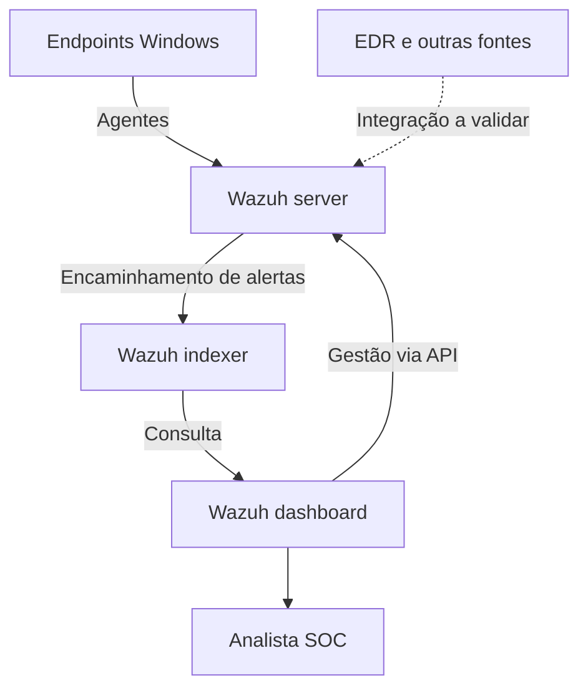

# SOC com Wazuh
**Endrigo Henrique Deronzi · Infraestrutura, redes e segurança**

Projeto de portfólio que documenta uma abordagem de monitoramento de segurança com Wazuh. O conteúdo foi reconstruído com dados fictícios, sem exportações de produção ou referências à empresa.

## Contexto e contribuição
Minha experiência inclui atuação com Wazuh e integração de logs de EDR ao monitoramento de segurança. Este repositório apresenta uma arquitetura de referência e exercícios de triagem; não reproduz o inventário, as regras ou os incidentes de um ambiente real.

## Objetivo
Centralizar eventos de segurança, investigar sinais suspeitos e registrar decisões de resposta com evidências.

## Arquitetura de referência

## Conteúdo
- [Arquitetura e escopo](docs/arquitetura.md)
- [Coleta Windows em laboratório](docs/coleta-windows.md)
- [Casos de uso e investigação](docs/casos-de-uso.md)
- [Roteiro de resposta](docs/runbook.md)
- [Eventos sintéticos](examples/eventos.json)
- [Fragmento de coleta](config/windows-eventchannels.xml)
- [Registro fictício de investigação](examples/investigacao.md)
- [Privacidade e limitações](docs/privacidade.md)

## Como usar
1. Leia o escopo e configure um laboratório próprio com Wazuh.
2. Revise a coleta já existente antes de adicionar o fragmento XML.
3. Use os eventos sintéticos para praticar as decisões do roteiro.
4. Valide coleta, decoders e regras na versão instalada.
5. Registre evidências e conclusão usando o modelo de investigação.

O JSON usa um esquema didático próprio. Não é uma exportação Wazuh, não contém IDs reais de regras e não pode ser importado como dashboard ou alerta nativo.

## Estado da entrega
| Item | Estado |
|---|---|
| Documentação e cenários fictícios | Incluídos |
| Fragmento de configuração Windows | Referência; sintaxe XML verificada |
| Validação de coleta em laboratório | Pendente |
| Integração EDR | Conceitual; decoder e transporte dependem da fonte |
| Integração Grafana | Evolução planejada |
| Resposta automática | Não implementada |

## Evolução planejada
- Validar eventos Windows em laboratório e registrar evidências anonimizadas.
- Validar ingestão de logs de EDR, normalização e regras específicas.
- Integrar indicadores ao Grafana com acesso de leitura.
- Medir tempo de triagem e cobertura com dados do laboratório.

Não são apresentados resultados operacionais medidos, certificação de conformidade ou cobertura completa de SOC.

## Competências
Wazuh · SIEM · Logs Windows · Investigação de eventos · Integração EDR · Resposta a incidentes · Documentação

## Referências oficiais
- [Arquitetura Wazuh](https://documentation.wazuh.com/current/getting-started/architecture.html)
- [Coleta por sistema operacional](https://documentation.wazuh.com/current/user-manual/capabilities/log-data-collection/configuration.html)
- [Configuração localfile](https://documentation.wazuh.com/current/user-manual/reference/ossec-conf/localfile.html)

Referências consultadas em 01/10/2026; confira a documentação correspondente à sua versão.
